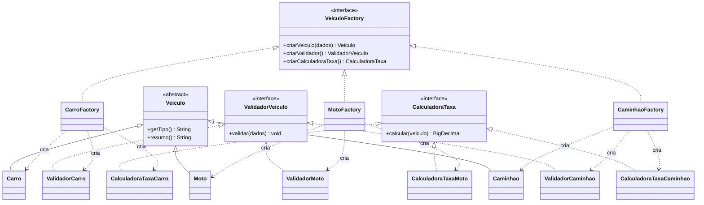

# Cadastro de Veículos Console

Projeto Java simples em terminal para demonstrar a evolução de uma solução inicial acoplada para uma solução usando o padrão GoF Abstract Factory.

## Problema

O sistema precisa cadastrar diferentes tipos de veículos: carro, moto e caminhão. Cada tipo possui uma família de objetos relacionada:

- o próprio veículo;
- um validador com regras específicas;
- uma calculadora de taxa específica.

Na versão inicial, a classe principal precisava conhecer diretamente todas as classes concretas e escolher cada uma usando vários `if`. Isso deixava o código mais acoplado e mais difícil de manter.

## Solução com Abstract Factory

A interface `VeiculoFactory` define os objetos que toda família de veículo deve criar:

```java
public interface VeiculoFactory {
    Veiculo criarVeiculo(DadosCadastroVeiculo dados);
    ValidadorVeiculo criarValidador();
    CalculadoraTaxa criarCalculadoraTaxa();
}
```

As factories concretas criam famílias coerentes:

- `CarroFactory`: cria `Carro`, `ValidadorCarro` e `CalculadoraTaxaCarro`;
- `MotoFactory`: cria `Moto`, `ValidadorMoto` e `CalculadoraTaxaMoto`;
- `CaminhaoFactory`: cria `Caminhao`, `ValidadorCaminhao` e `CalculadoraTaxaCaminhao`.



Assim, a aplicação principal passa a depender da abstração `VeiculoFactory`, e não das classes concretas de cada tipo de veículo.

## Evolução com reflexão e anotações

As validações comuns do cadastro usam anotações próprias nos componentes do record `DadosCadastroVeiculo`:

```java
@Obrigatorio(mensagem = "Placa é obrigatória.")
@PlacaMercosul
String placa
```

O `ValidadorAnotacoes` usa reflexão para ler essas anotações em tempo de execução e aplicar regras genéricas, como campo obrigatório e formato de placa. Com isso, os validadores específicos de carro, moto e caminhão não precisam conhecer manualmente todos os campos básicos do cadastro.
